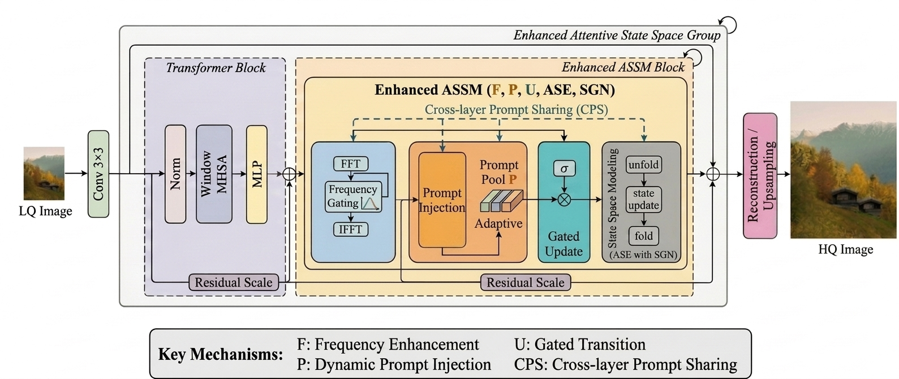

# HIFER-Mamba

> HIFER-Mamba: Enhancing State Space Models for Image Super-Resolution with Frequency and Prompt Modeling

## Overview
HIFER-Mamba enhances the original MambaIR framework through three complementary components:

- Frequency-aware Feature Enhancement
- Progressive Feature Integration
- Nonlinear State Enhancement

These designs significantly improve texture recovery and structural reconstruction while preserving the efficiency of state-space modeling.

## Motivation
Image super-resolution requires both fine-grained texture restoration and robust structural reconstruction. By combining frequency-aware enhancement, progressive feature integration, and nonlinear state modeling, HIFER-Mamba aims to strengthen both local detail recovery and global contextual modeling.

## Method overview
1. Extract deep features from low-resolution inputs.
2. Apply frequency-aware enhancement to strengthen texture and detail representation.
3. Integrate multi-stage features progressively for richer reconstruction.
4. Use nonlinear state enhancement to improve the expressiveness of state-space modeling.

## Model architecture

The overall architecture illustrates the interaction among feature extraction, frequency-aware enhancement, progressive integration, and final reconstruction.

## Pipeline

This pipeline summarizes the core processing path of HIFER-Mamba from input image to high-quality reconstruction.

## Experimental highlights

Representative results demonstrate improved texture fidelity and structural consistency over baseline methods.

## Repository structure
- analysis/: analysis notes, ablation studies, and experiment summaries
- datasets/: datasets and preprocessing assets
- experiments/: training and evaluation scripts, configs, logs
- figures/: paper figures and supporting visualizations
- results/: generated results, checkpoints, and sample outputs
- docs/: paper-style project page

## Quick access
- Interactive project page: [docs/index.html](docs/index.html)
- Local preview page: [index.html](index.html)

