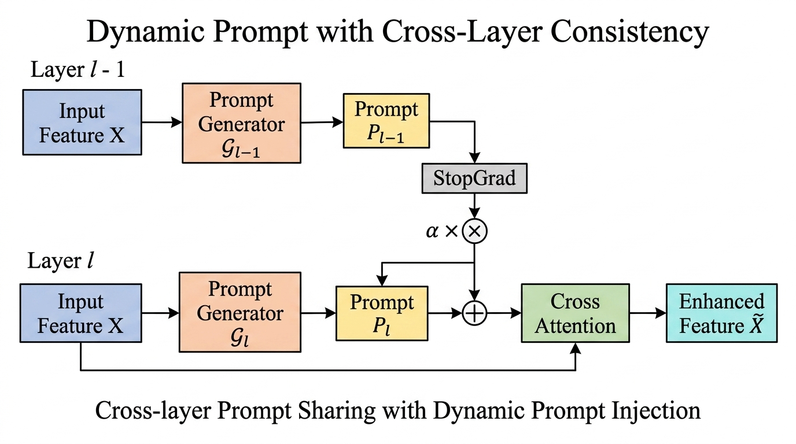
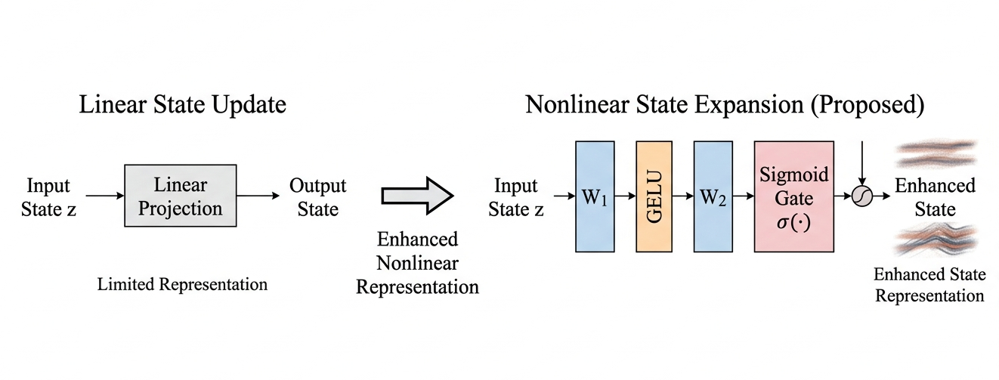
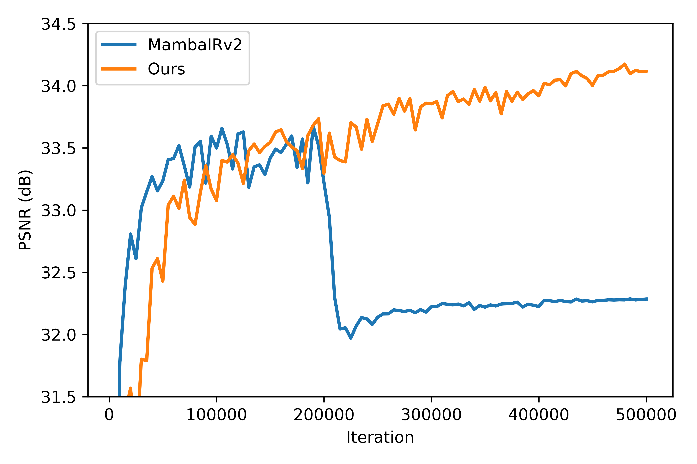
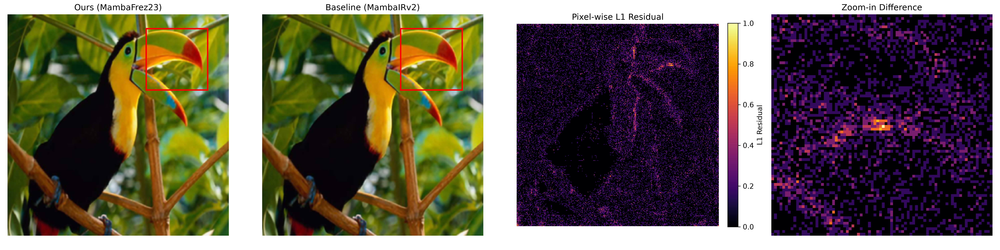
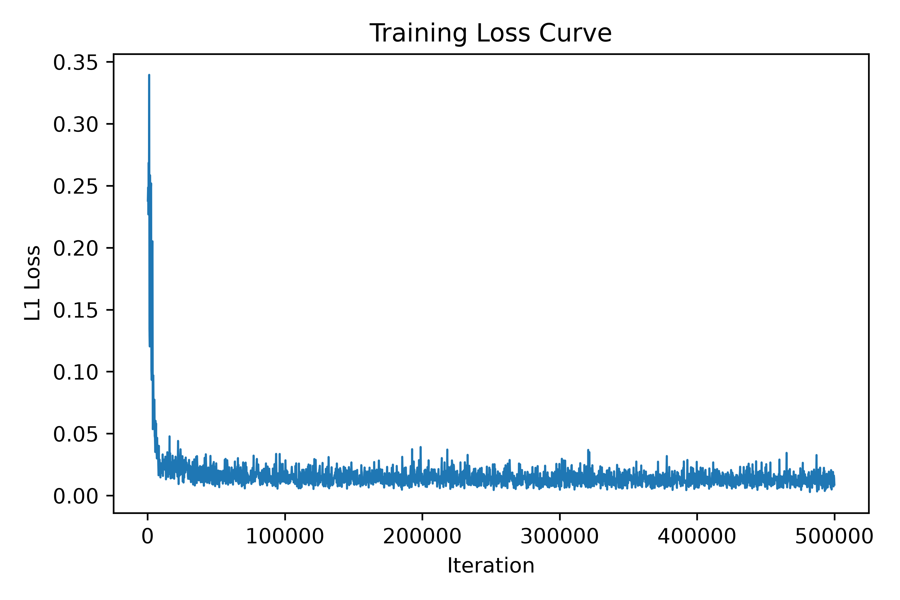

# HIFER-Mamba

> **HIFER-Mamba: High-frequency Information Feature Enhancement and Reconstruction for Image Super-Resolution**

<p align="center">

[]()
[]()
[]()
[]()

</p>

Official implementation of **HIFER-Mamba**, a frequency-aware Mamba framework for image super-resolution.

---

# News

- 🔥 **2026.07** Paper submitted to **IEEE Transactions on Image Processing (TIP)** and currently **under review**.
- 🔥 Project page, pretrained models and training code will be released after paper acceptance.

---

# Overview

HIFER-Mamba is built upon **MambaIR** and introduces three lightweight yet effective improvements for image super-resolution:

- **Frequency-aware Feature Enhancement**
- **Progressive Feature Integration**
- **Nonlinear State Enhancement**


# Framework

<p align="center">

</p>


In addition, we highlight two specific innovations below:

- **Dynamic Prompt with Cross-Layer Consistency (P)**: To provide adaptive guidance for different layers, we introduce a dynamic prompt generation mechanism. Unlike conventional static prompts that remain fixed during inference, our prompts are dynamically generated according to the current input features, enabling more flexible and content-aware feature modulation across different image structures and degradation patterns.

  <p align="center">
  
  </p>

- **Nonlinear State Expansion (U)**: Compared with conventional linear state transitions, the proposed nonlinear expansion mechanism enables more expressive feature interaction and improves the modeling of complex spatial structures. In particular, the gated nonlinear transformation enhances feature selectivity and stabilizes deep feature propagation, which is beneficial for recovering fine textures and structurally rich regions in image super-resolution tasks.

  <p align="center">
  
  </p>

These complementary designs significantly improve high-frequency texture reconstruction, structural recovery and feature representation while preserving the efficiency of state-space models.

---

# Motivation

Image super-resolution requires recovering fine textures while maintaining structural consistency.

HIFER-Mamba integrates frequency-domain representation, progressive feature interaction and nonlinear state modeling into a unified Mamba framework, leading to more faithful image reconstruction.

---


---

# Quantitative Results

<p align="center">

</p>

HIFER-Mamba consistently achieves competitive quantitative performance on five widely used benchmark datasets.

---

# Visual Comparison

<p align="center">

</p>

Our model reconstructs sharper edges, richer textures and more faithful structural details than previous Mamba-based methods.

---

# Training Behaviour

<p align="center">

</p>

The training process exhibits smooth convergence and stable optimization throughout learning.

---

# Key Features

- ✅ Frequency-aware enhancement for recovering high-frequency textures.
- ✅ Progressive feature interaction across deep Mamba blocks.
- ✅ Nonlinear state enhancement for stronger representation capability.
- ✅ Superior quantitative performance on standard SR benchmarks.
- ✅ Stable optimization with efficient inference.

---

# Repository Structure

```text
analysis/          Analysis scripts
basicsr/           BasicSR framework
datasets/          Training and testing datasets
experiments/       Configurations and checkpoints
figures/           Figures used in the paper
results/           Reconstruction results
options/           Training/testing options
docs/              Project webpage
```

---

# Getting Started

## Training

```bash
python basicsr/train.py -opt options/train/train_HIFER_Mamba_x2.yml
```

## Testing

```bash
python basicsr/test.py -opt options/test/test_HIFER_Mamba_x2.yml
```

---

# Experimental Highlights

- Frequency-aware representation improves texture reconstruction.
- Progressive feature integration enhances feature consistency.
- Nonlinear state enhancement increases representation capability.
- Better visual quality with competitive PSNR/SSIM.
- Stable convergence during optimization.

---

# Project Page

🚧 Coming Soon.

The project webpage, pretrained models, checkpoints and supplementary materials will be released after paper acceptance.

---

# Citation

If you find this work useful, please consider citing

```bibtex
@article{jiang2026hifermamba,
  title={HIFER-Mamba: High-frequency Information Feature Enhancement and Reconstruction for Image Super-Resolution},
  author={Nan Jiang and others},
  journal={Under Review},
  year={2026}
}
```

---

# Acknowledgement

This project is built upon the excellent open-source projects **BasicSR** and **MambaIR**. We sincerely thank the original authors for making their valuable code publicly available.
