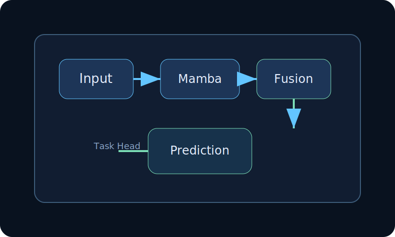
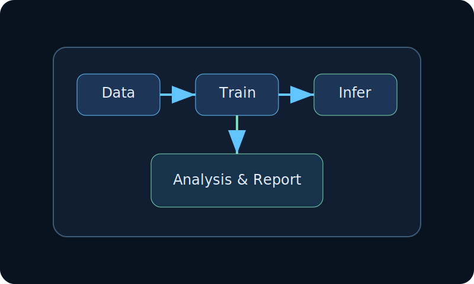
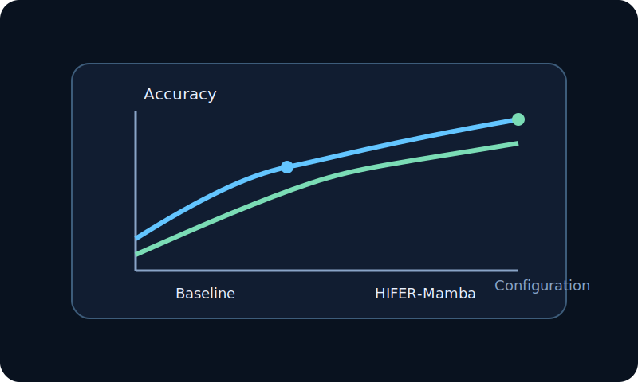

# HIFER-Mamba

> 这是一个面向审稿人和读者的论文解说首页。打开 GitHub 仓库后，直接就能看到方法简介、模型结构和实验说明。

## Abstract
HIFER-Mamba 是一个面向长序列建模与多尺度特征融合的模型框架。它将 Mamba 的高效状态空间建模能力与特征增强机制相结合，目标是提升模型在复杂任务中的表达能力与稳定性。

## Why this work matters
- 支持更高效的长序列建模
- 融合多尺度特征，提升表示能力
- 适合论文汇报、审稿交流和项目展示

## Method overview
1. 输入特征经过预处理与编码阶段
2. 使用 Mamba 结构进行高效序列建模
3. 通过特征融合模块增强不同尺度的信息表达
4. 最终由预测头输出任务结果

## Model architecture

这张图展示了模型从输入特征到输出结果的整体流程，包括编码、融合与预测三个关键阶段。

## Workflow

流程图说明了数据准备、模型训练、结果分析与推理验证之间的关系。

## Experimental highlights

实验结果图用于展示模型在不同配置下的表现提升与稳定性表现。

## Repository structure
- data/: 实验数据与预处理资源
- models/: 核心模型模块
- figures/: 论文图示与结果图
- docs/: 论文风格展示页

## Quick access
- 交互式展示页: [docs/index.html](docs/index.html)
- 项目样式预览: [index.html](index.html)

如果你希望，我可以继续把这个 README 再扩展成更像论文主页的版本，例如加入“Introduction、Method、Experiments、Citation”四个正式论文章节。
